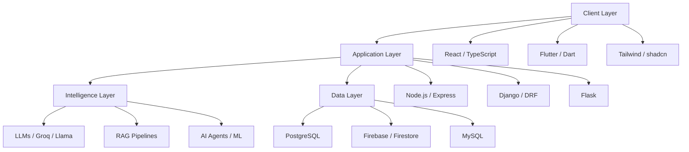

<div align="center">

<!-- ═══════════════════════════════════════════════════════════════════════════ -->
<!-- HERO SECTION -->
<!-- ═══════════════════════════════════════════════════════════════════════════ -->


<br/>


<br/><br/>


&nbsp;
<a href="mailto:sachintha.ranasinghe.int@gmail.com">
  
</a>

<br/><br/>

<a href="https://github.com/SachinthaRanasinghe">
  
</a>
&nbsp;
<a href="https://www.linkedin.com/in/sachintha-ranasinghe-620b572b4">
  
</a>
&nbsp;
<a href="https://SachinthaRanasinghe.github.io/portfolio/">
  
</a>
&nbsp;
<a href="mailto:sachintha.ranasinghe.int@gmail.com">
  
</a>

<br/><br/>


</div>

<br/>

<!-- ═══════════════════════════════════════════════════════════════════════════ -->
<!-- SECTION DIVIDER -->
<!-- ═══════════════════════════════════════════════════════════════════════════ -->

<svg xmlns="http://www.w3.org/2000/svg" width="100%" height="2" viewBox="0 0 1200 2" fill="none">
  <rect width="1200" height="2" fill="url(#gradient)" opacity="0.6"/>
  <defs>
    <linearGradient id="gradient" x1="0" y1="0" x2="1200" y2="0">
      <stop offset="0%" stop-color="#0f0f0f"/>
      <stop offset="50%" stop-color="#6366f1"/>
      <stop offset="100%" stop-color="#0f0f0f"/>
    </linearGradient>
  </defs>
</svg>

<div align="center">


</div>

<br/>

<!-- ═══════════════════════════════════════════════════════════════════════════ -->
<!-- ABOUT -->
<!-- ═══════════════════════════════════════════════════════════════════════════ -->

<div align="center">

## About

<sub>**AI Systems Engineer · Full-Stack Developer · Production AI Architect**</sub>

</div>

<br/>

<table align="center" width="90%">
<tr>
<td width="50%" valign="top">

```yaml
name: Sachintha Ranasinghe
role: AI Systems Engineer
location: Colombo, Sri Lanka
focus:
  - Large Language Models
  - Retrieval-Augmented Generation
  - Intelligent Web & Mobile Systems
  - Scalable Cloud Architecture
education: BSc (Hons) Software Engineering — First Class
university: Cardiff Metropolitan University
```

</td>
<td width="50%" valign="top">

I architect and ship **production-ready intelligent systems** — from LLM-powered applications and RAG pipelines to full-stack web and mobile platforms deployed at scale.

My work spans **adaptive learning**, **career intelligence**, **enterprise automation**, and **AI-native productivity tools**. I prioritize clean APIs, robust backend design, and interfaces that feel effortless under the hood of complex AI logic.

I build with **React**, **Flutter**, **Node.js**, **Django**, **PostgreSQL**, **Firebase**, and modern AI infrastructure — translating research-grade capabilities into software people rely on every day.

</td>
</tr>
</table>

<br/>

<div align="center">

| | |
|:---:|:---:|
| **Specialization** | LLM Integration · RAG · AI Agents · ML Pipelines |
| **Domains** | Education · Productivity · Careers · Enterprise · Automation |
| **Approach** | System design first · API-driven · User-centered · Production-grade |

</div>

<br/>

<!-- ═══════════════════════════════════════════════════════════════════════════ -->
<!-- GITHUB STATS -->
<!-- ═══════════════════════════════════════════════════════════════════════════ -->

<div align="center">


<br/>

## Engineering Activity

<sub>Metrics that reflect sustained, production-oriented development</sub>

<br/><br/>


&nbsp;&nbsp;


<br/><br/>


&nbsp;&nbsp;


<br/><br/>


</div>

<br/>

<!-- ═══════════════════════════════════════════════════════════════════════════ -->
<!-- TECH STACK -->
<!-- ═══════════════════════════════════════════════════════════════════════════ -->

<div align="center">


<br/>

## Tech Stack

<sub>Technologies I use to design, build, and deploy intelligent production systems</sub>

</div>

<br/>

<div align="center">

### Languages


<br/><br/>

### Frontend


<br/><br/>

### Backend


<br/><br/>

### Mobile


<br/><br/>

### Databases


<br/><br/>

### AI / Machine Learning


<br/><br/>

### Tools


</div>

<br/>

<!-- ═══════════════════════════════════════════════════════════════════════════ -->
<!-- SKILL GROUPS -->
<!-- ═══════════════════════════════════════════════════════════════════════════ -->

<div align="center">

## Core Competencies

</div>

<br/>

<table align="center" width="95%">
<tr>
<td align="center" width="33%">

**AI & Intelligence**

<br/><br/>

`LLM Integration` `RAG Pipelines` `Prompt Engineering`

`AI Agents` `ML Pipelines` `LightGBM`

`Groq API` `Llama` `scikit-learn`

</td>
<td align="center" width="33%">

**Full-Stack Engineering**

<br/><br/>

`React` `TypeScript` `Node.js`

`Django` `DRF` `Flutter`

`PostgreSQL` `Firebase` `REST APIs`

</td>
<td align="center" width="33%">

**Systems & Architecture**

<br/><br/>

`System Design` `Scalable Backends`

`Database Design` `Authentication`

`RBAC` `Cloud Deployment`

`Performance Optimization`

</td>
</tr>
</table>

<br/>

<!-- ═══════════════════════════════════════════════════════════════════════════ -->
<!-- FEATURED PROJECTS -->
<!-- ═══════════════════════════════════════════════════════════════════════════ -->

<div align="center">


<br/>

## Featured Projects

<sub>Production-grade systems built with AI at the core</sub>

</div>

<br/>

<!-- PROJECT 1 -->

<table align="center" width="95%">
<tr>
<td width="100%">

<div align="center">

### AI Daily Life Assistant


<br/><br/>

**AI-powered productivity assistant** — intelligent daily planning with mood tracking, habit management, finance tracking, adaptive scheduling, smart reminders, and personalized AI insights.

<br/><br/>

<a href="https://github.com/SachinthaRanasinghe/daily-life-ai-app">
  
</a>

</div>

</td>
</tr>
</table>

<br/>

<!-- PROJECT 2 -->

<table align="center" width="95%">
<tr>
<td width="100%">

<div align="center">

### SmartCareers.lk


<br/><br/>

**AI-powered career platform** — resume builder, intelligent job matching, career recommendations, employer dashboard, university portal, student portal, and integrated AI assistant.

<br/><br/>

<a href="https://github.com/SachinthaRanasinghe/smartcareers-lk-">
  
</a>

</div>

</td>
</tr>
</table>

<br/>

<!-- PROJECT 3 -->

<table align="center" width="95%">
<tr>
<td width="100%">

<div align="center">

### EduMind AI


<br/><br/>

**Adaptive learning platform** — AI tutor, automated grading, learning analytics, and student risk prediction powered by LLM integration and data-driven insights.

<br/><br/>


</div>

</td>
</tr>
</table>

<br/>

<!-- PROJECT 4 -->

<table align="center" width="95%">
<tr>
<td width="100%">

<div align="center">

### Cafe Piranha Staff Management


<br/><br/>

**Enterprise staff management system** — real-time attendance, GPS clock-in, payroll processing, reporting dashboards, and session tracking for operational efficiency.

<br/><br/>


</div>

</td>
</tr>
</table>

<br/>

<!-- PROJECT 5 -->

<table align="center" width="95%">
<tr>
<td width="100%">

<div align="center">

### Math Misconception Analyzer


<br/><br/>

**Machine learning classifier for education** — CSV batch prediction and student misconception analysis using trained ML models with an interactive Streamlit interface.

<br/><br/>


</div>

</td>
</tr>
</table>

<br/>

<!-- ═══════════════════════════════════════════════════════════════════════════ -->
<!-- OTHER PROJECTS -->
<!-- ═══════════════════════════════════════════════════════════════════════════ -->

<div align="center">

## Additional Projects

<sub>Experiments, tools, and supporting systems in the portfolio</sub>

</div>

<br/>

<table align="center" width="95%">
<thead>
<tr>
<th align="center">Project</th>
<th align="center">Stack</th>
<th align="center">Description</th>
</tr>
</thead>
<tbody>
<tr>
<td align="center"><strong>AI Portfolio That Talks Back</strong></td>
<td align="center">


</td>
<td align="center">Interactive AI portfolio with conversational RAG backend and 3D visualization</td>
</tr>
<tr>
<td align="center"><strong>Gallery Cafe Management System</strong></td>
<td align="center">


</td>
<td align="center">Full-stack cafe management with inventory, orders, and reporting</td>
</tr>
<tr>
<td align="center"><strong>Portfolio Website</strong></td>
<td align="center">


</td>
<td align="center">
<a href="https://SachinthaRanasinghe.github.io/portfolio/">SachinthaRanasinghe.github.io/portfolio</a>
</td>
</tr>
</tbody>
</table>

<br/>

<!-- ═══════════════════════════════════════════════════════════════════════════ -->
<!-- ENGINEERING EXPERTISE -->
<!-- ═══════════════════════════════════════════════════════════════════════════ -->

<div align="center">


<br/>

## Engineering Expertise

<sub>Capabilities applied across every production system I ship</sub>

</div>

<br/>

<table align="center" width="95%">
<tr>
<td align="center" width="25%">

**AI Architecture**

<br/><br/>

LLM Integration

RAG Systems

Prompt Engineering

AI Agents

ML Pipelines

</td>
<td align="center" width="25%">

**Backend Systems**

<br/><br/>

REST APIs

Scalable Backends

Database Design

Authentication

Role-based Access Control

</td>
<td align="center" width="25%">

**Infrastructure**

<br/><br/>

Cloud Deployment

Performance Optimization

System Design

Firebase

Netlify

</td>
<td align="center" width="25%">

**Product Engineering**

<br/><br/>

Mobile Development

UX Architecture

API Design

Full-Stack Delivery

Production Systems

</td>
</tr>
</table>

<br/>

<div align="center">

| Category | Technologies & Practices |
|:---------|:-------------------------|
| **Intelligence Layer** | LLMs · RAG · Groq · Llama · Prompt Engineering · AI Agents · LightGBM · scikit-learn |
| **Application Layer** | React · TypeScript · Flutter · Node.js · Django · DRF · Express · Flask |
| **Data Layer** | PostgreSQL · MySQL · Firebase · Firestore · SQL · Hive |
| **Operations** | Git · GitHub · Netlify · Cloud Deployment · Performance Optimization |
| **Design** | Tailwind CSS · shadcn/ui · Radix UI · Chart.js · Recharts · Responsive UX |

</div>

<br/>

<!-- ═══════════════════════════════════════════════════════════════════════════ -->
<!-- CURRENTLY LEARNING -->
<!-- ═══════════════════════════════════════════════════════════════════════════ -->

<div align="center">

## Currently Exploring

<sub>Advancing capabilities in the next generation of AI systems</sub>

</div>

<br/>

<div align="center">


<br/><br/>


</div>

<br/>

<table align="center" width="90%">
<tr>
<td align="center" width="50%">

**Focus Areas**

<br/><br/>

Building autonomous agent workflows with orchestration frameworks

Designing production RAG pipelines with vector store optimization

Implementing MCP-compatible tool interfaces for AI systems

Architecting multi-agent systems for complex task decomposition

</td>
<td align="center" width="50%">

**Learning Stack**

<br/><br/>

`LangGraph` · `Vector DBs` · `MCP` · `Agent Frameworks`

`Advanced RAG` · `Embeddings` · `Tool Use` · `Orchestration`

`Production Monitoring` · `Eval Pipelines` · `Cost Optimization`

</td>
</tr>
</table>

<br/>

<!-- ═══════════════════════════════════════════════════════════════════════════ -->
<!-- EDUCATION -->
<!-- ═══════════════════════════════════════════════════════════════════════════ -->

<div align="center">

## Education

<sub>Academic foundation in software engineering with consistent First Class honors</sub>

</div>

<br/>

<table align="center" width="95%">
<thead>
<tr>
<th align="left">Qualification</th>
<th align="center">Institution</th>
<th align="center">Result</th>
<th align="center">Status</th>
</tr>
</thead>
<tbody>
<tr>
<td align="left"><strong>BSc (Hons) Software Engineering</strong></td>
<td align="center">Cardiff Metropolitan University</td>
<td align="center">

</td>
<td align="center">

</td>
</tr>
<tr>
<td align="left"><strong>Higher Diploma in Computing & Software Engineering</strong></td>
<td align="center">—</td>
<td align="center">

</td>
<td align="center">

</td>
</tr>
<tr>
<td align="left"><strong>International Diploma in ICT</strong></td>
<td align="center">—</td>
<td align="center">

</td>
<td align="center">

</td>
</tr>
</tbody>
</table>

<br/>

<!-- ═══════════════════════════════════════════════════════════════════════════ -->
<!-- WHAT I BUILD -->
<!-- ═══════════════════════════════════════════════════════════════════════════ -->

<div align="center">

## What I Build

</div>

<br/>

<table align="center" width="95%">
<tr>
<td align="center" width="20%">

**Intelligent Products**

<br/><br/>

LLM-powered applications with real user value

</td>
<td align="center" width="20%">

**Scalable Backends**

<br/><br/>

API-first architectures built for growth

</td>
<td align="center" width="20%">

**AI Pipelines**

<br/><br/>

RAG, ML classification, and agent workflows

</td>
<td align="center" width="20%">

**Mobile Systems**

<br/><br/>

Cross-platform Flutter applications

</td>
<td align="center" width="20%">

**Enterprise Tools**

<br/><br/>

Staff management, dashboards, automation

</td>
</tr>
</table>

<br/>

<!-- ═══════════════════════════════════════════════════════════════════════════ -->
<!-- PROJECT DOMAINS -->
<!-- ═══════════════════════════════════════════════════════════════════════════ -->

<div align="center">

## Problem Domains

</div>

<br/>

<div align="center">


</div>

<br/>

<table align="center" width="90%">
<tr>
<td align="center">

| Domain | Systems Built |
|:-------|:--------------|
| **Education** | EduMind AI · Math Misconception Analyzer · Adaptive Learning Platforms |
| **Productivity** | AI Daily Life Assistant · Habit & Finance Tracking · Smart Reminders |
| **Careers** | SmartCareers.lk · Resume Builder · Job Matching · AI Career Assistant |
| **Enterprise** | Cafe Piranha Staff Management · GPS Attendance · Payroll Systems |
| **Automation** | AI Agents · RAG Pipelines · Conversational Interfaces |

</td>
</tr>
</table>

<br/>

<!-- ═══════════════════════════════════════════════════════════════════════════ -->
<!-- DEVELOPMENT PHILOSOPHY -->
<!-- ═══════════════════════════════════════════════════════════════════════════ -->

<div align="center">

## Development Philosophy

</div>

<br/>

<table align="center" width="95%">
<tr>
<td width="50%" valign="top" align="center">

> *"Intelligence should feel invisible — complex systems, effortless experiences."*

<br/>

Production AI is not about wrapping an API call in a UI. It is about **architecture**, **reliability**, **context engineering**, and **products that earn trust** at scale.

</td>
<td width="50%" valign="top">

| Principle | Application |
|:----------|:------------|
| **System Design First** | Scalable architecture before feature velocity |
| **API-Driven** | Clean contracts between frontend, backend, and AI layers |
| **User-Centered** | Intelligence serves the workflow, not the demo |
| **Production-Grade** | Auth, RBAC, monitoring, and performance from day one |
| **Iterative Intelligence** | Ship, measure, refine prompts, models, and pipelines |

</td>
</tr>
</table>

<br/>

<!-- ═══════════════════════════════════════════════════════════════════════════ -->
<!-- GITHUB METRICS DETAIL -->
<!-- ═══════════════════════════════════════════════════════════════════════════ -->

<div align="center">

## Repository Analytics

</div>

<br/>

<div align="center">


</div>

<br/>

<div align="center">


</div>

<br/>

<!-- ═══════════════════════════════════════════════════════════════════════════ -->
<!-- TECH STACK VISUAL -->
<!-- ═══════════════════════════════════════════════════════════════════════════ -->

<div align="center">

## Stack Overview

</div>

<br/>

<div align="center">



</div>

<br/>

<!-- ═══════════════════════════════════════════════════════════════════════════ -->
<!-- CONNECT -->
<!-- ═══════════════════════════════════════════════════════════════════════════ -->

<div align="center">


<br/>

## Connect

<sub>Open to collaborations on AI systems, full-stack products, and intelligent platform engineering</sub>

<br/><br/>

<a href="mailto:sachintha.ranasinghe.int@gmail.com">
  
</a>

<br/><br/>

<a href="https://github.com/SachinthaRanasinghe">
  
</a>
&nbsp;
<a href="https://www.linkedin.com/in/sachintha-ranasinghe-620b572b4">
  
</a>
&nbsp;
<a href="https://SachinthaRanasinghe.github.io/portfolio/">
  
</a>

<br/><br/>

<table align="center">
<tr>
<td align="center">
<strong>GitHub</strong><br/>
<a href="https://github.com/SachinthaRanasinghe">github.com/SachinthaRanasinghe</a>
</td>
<td align="center">
<strong>LinkedIn</strong><br/>
<a href="https://www.linkedin.com/in/sachintha-ranasinghe-620b572b4">linkedin.com/in/sachintha-ranasinghe</a>
</td>
<td align="center">
<strong>Portfolio</strong><br/>
<a href="https://SachinthaRanasinghe.github.io/portfolio/">SachinthaRanasinghe.github.io/portfolio</a>
</td>
<td align="center">
<strong>Email</strong><br/>
<a href="mailto:sachintha.ranasinghe.int@gmail.com">sachintha.ranasinghe.int@gmail.com</a>
</td>
</tr>
</table>

</div>

<br/>

<!-- ═══════════════════════════════════════════════════════════════════════════ -->
<!-- FOOTER -->
<!-- ═══════════════════════════════════════════════════════════════════════════ -->

<div align="center">


<br/>

<sub>

**Sachintha Ranasinghe** · AI Systems Engineer · Full-Stack Developer · Colombo, Sri Lanka

<br/>

Building intelligent systems that ship to production.

<br/><br/>


<br/><br/>

© 2026 Sachintha Ranasinghe · Designed for production · Built with precision

</sub>

</div>
